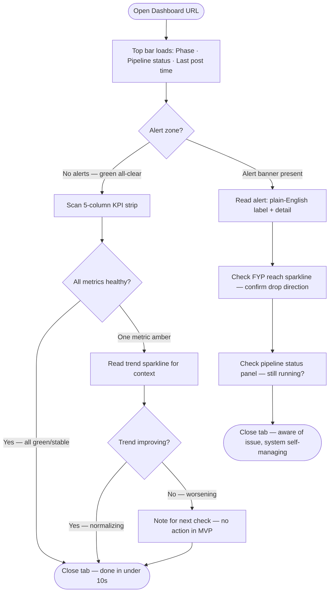
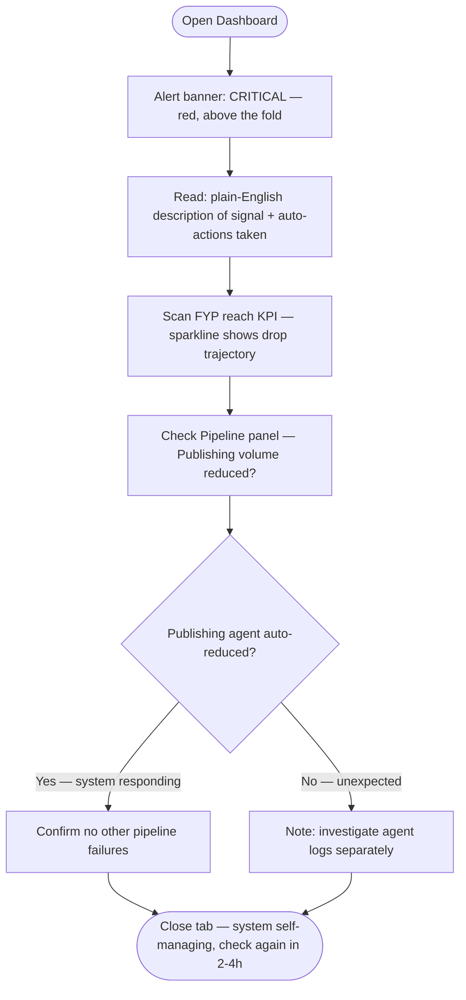
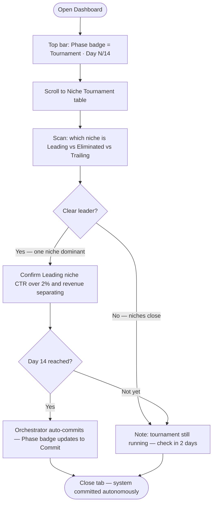

# UX Design Specification tiktok-faceless

**Author:** Ivanma
**Date:** 2026-03-09

---

<!-- UX design content will be appended sequentially through collaborative workflow steps -->

## Executive Summary

### Project Vision

tiktok-faceless is a fully autonomous multi-agent system that runs a TikTok faceless creator account end-to-end — researching trending products, producing videos, posting, optimizing, and managing affiliate revenue — with zero human intervention. The monitoring dashboard is the sole human touchpoint: the operator checks it occasionally to confirm the system is working, but never intervenes in content production or publishing. The system succeeds when revenue compounds without any daily operator input.

### Target Users

**Primary: Ivanma — The Technical Indie Operator**
A technically fluent solo builder (Python-comfortable, system-design oriented) who runs the system as a personal revenue engine. Not a content creator by identity — an operator. Reviews the dashboard at irregular intervals (weekly, not daily). Never touches content production. Considers the system successful when the dashboard shows $1K+/month affiliate commissions with no manual work done. Mobile and desktop access both plausible but primary review likely desktop.

### Key Design Challenges

1. **Signal vs. noise at a glance** — the system generates high-volume data (per-video, per-niche, per-account) but the operator primarily needs to answer "is it working?" The dashboard must make that the default read with minimal scanning.
2. **Async mental model** — operator checks in at irregular intervals. The UX must orient them instantly to what changed since the last visit and surface any anomalies without requiring them to hunt.
3. **Read-only trust** — no intervention controls in MVP. The dashboard must communicate enough depth that the operator trusts the system is optimizing correctly, even without the ability to adjust anything.
4. **Multi-dimensional data coherence** — revenue, retention, CTR, pipeline health, and suppression signals are different units, different cadences, and different granularities. Grouping them meaningfully without overwhelming is non-trivial.

### Design Opportunities

1. **Phase-awareness as primary orientation** — Tournament / Commit / Scale phase should anchor the entire dashboard. It reframes all other data (e.g., high volume posting is expected and healthy in Tournament; the same signal in Commit would be a bug).
2. **Exception-first layout** — suppression signals and anomalies surfaced at the top; healthy metrics de-emphasized. The operator's real job is "notice when something is wrong," not review every number.
3. **Trend lines over point-in-time snapshots** — retention rates and CTR are only meaningful as trends. Sparklines per video/niche communicate trajectory far better than raw numbers alone.

## Core User Experience

### Defining Experience

The defining interaction is **status verification in under 10 seconds**: open the dashboard, confirm revenue is trending up and the pipeline is running, close it. Exploration of detailed metrics (per-video breakdown, historical trends) is secondary. The dashboard must default to answering "is it working?" before offering any depth.

### Platform Strategy

- **Platform:** Web application, responsive
- **Primary device:** Desktop browser (full-width layout with rich data tables and charts)
- **Secondary device:** Mobile browser (condensed, scroll-friendly single-column summary)
- **Hosting:** Remotely hosted (VPS or cloud) so the operator can access from any device
- **Auth:** Lightweight single-user auth (API key or simple password) — no multi-user RBAC needed for MVP
- **Data refresh:** Auto-refreshing on a short interval (60s or configurable) — no manual refresh required

### Effortless Interactions

- **Auto-refresh** — data stays current without any operator action
- **No-click primary read** — all critical status (pipeline health, revenue today/this week, active suppression signals) visible above the fold on desktop without any navigation
- **Time-since-last-post** displayed automatically — operator can confirm pipeline is alive without calculating
- **Phase indicator always visible** — Tournament / Commit / Scale phase shown persistently so all other data is interpreted in context

### Critical Success Moments

1. **"It's working" (90% of visits):** Dashboard loads → green pipeline status, revenue trending up, no suppression flags → operator closes tab in under 10 seconds. No friction, no hunting.
2. **"Something needs attention" (exception case):** Suppression signal or pipeline failure surfaces immediately at top of page on load — operator sees it without scrolling.
3. **"First commission earned" (milestone):** A distinct visual callout for the first affiliate commission — not just a number in a table but a recognized milestone moment.

### Experience Principles

1. **Exception-first** — Anomalies, suppression signals, and failures surface before everything else. Healthy metrics are de-emphasized; problems are unmissable.
2. **Phase-aware context** — Every metric is interpreted through the current system phase. The dashboard always tells you what phase it's in so you never misread a high-volume day as unusual.
3. **Trend over snapshot** — Revenue, retention, and CTR shown as sparklines/trends, not point-in-time values. Direction matters more than today's number.
4. **Zero required interaction** — The primary read requires no clicks, no filters, no date range selection. Everything critical is pre-configured and auto-refreshing.

## Desired Emotional Response

### Primary Emotional Goals

**Primary: Calm confidence.** Not excitement, not anxiety — the quiet assurance that the machine is doing its job. Like checking a bank balance and seeing it go up. The operator doesn't need to feel thrilled; they need to feel *certain*.

**Secondary feelings:**
- **Control without effort** — the operator understands what the system is doing even without doing it themselves. Transparent, not opaque.
- **Trust** — data is real, consistent, and explainable. No second-guessing whether what's shown reflects reality.
- **Mild satisfaction** — revenue trending up, retention improving. A quiet "good" moment, not a dopamine spike.

### Emotional Journey Mapping

| Moment | Desired Emotion |
|---|---|
| Dashboard loads (routine check) | Calm, instant orientation |
| All systems green, revenue up | Quiet satisfaction, close tab |
| Suppression signal detected | Alert without panic — clear next state visible |
| Suppression signal cleared | Relief |
| First affiliate commission | Pride and validation — thesis proven |
| $1K/month milestone crossed | Relief + excitement — model confirmed |
| Phase transition (Tournament → Commit) | Confidence — system made a data-driven decision |

### Micro-Emotions

**Most critical: Trust vs. Skepticism.**
If the operator ever thinks "I'm not sure this data is accurate," the entire dashboard loses its value. Every design decision must reinforce data fidelity and freshness.

**Secondary micro-emotions to design for:**
- Confidence (not confusion) when reading any metric — labels and context are always self-explanatory
- Accomplishment (not frustration) when reviewing weekly performance
- Calm (not anxiety) when seeing high-volume posting days in Tournament Phase

### Design Implications

| Emotional Goal | UX Design Approach |
|---|---|
| Calm confidence | Muted color palette, clean typography, no flashing/urgent UI by default |
| Trust | Last-updated timestamps on every metric; clear data source labels |
| Exception clarity | Red/amber reserved for genuine anomalies only; green used sparingly and meaningfully |
| Milestone pride | Subtle but distinct callouts for first commission and phase transitions |
| Avoid overwhelm | Strict metric hierarchy — status first, detail on demand |
| Avoid false confidence | No metric shown without recency indicator; stale data flagged visibly |

### Emotional Design Principles

1. **Calm by default** — the visual language communicates stability. Urgency is a deliberate signal, not the ambient state.
2. **Trust through transparency** — every number shows when it was last updated and where it comes from. Opacity destroys trust.
3. **Reserve red for real problems** — color coding must be honest. If everything is green, great; if red appears, it means something.
4. **Celebrate milestones distinctly** — first commission and phase transitions deserve a visual moment, not a buried table row.

## UX Pattern Analysis & Inspiration

### Inspiring Products Analysis

**Linear** — Issue tracking for engineers
- Dense information presented cleanly without visual clutter
- Excellent status/priority signaling without color overload
- Sidebar navigation that collapses and stays out of the way
- Instant feel — no loading states visible, data appears immediately
- *Relevant because:* tiktok-faceless dashboard is also engineer-operated, data-dense, and needs the same "fast and trustworthy" feel

**Grafana** — Ops/metrics dashboards
- Panel-based layout: each metric is a self-contained card with its own context
- Sparklines and time-series are first-class citizens, not afterthoughts
- Threshold-based color coding — red only when a threshold is crossed, not ambient decoration
- Designed for operators who check in periodically to confirm system health
- *Relevant because:* this is essentially the same use case — an operator monitoring an autonomous system

**Stripe Dashboard** — Financial operations
- Revenue numbers front and center with clear hierarchy
- Milestone callouts for meaningful financial events (first payment, payout thresholds)
- Transaction-level drilldown that doesn't contaminate the top-level summary
- "Updated just now" freshness signals that build trust in the data
- *Relevant because:* revenue tracking and milestone moments are core to this dashboard

**Vercel/Railway** — Deployment pipeline status
- Pipeline shown as sequential step-by-step status (build → deploy → live)
- Pass/fail/running states per step with clear iconography
- Log access is secondary — status is the hero, detail is on demand
- *Relevant because:* the agent pipeline (Research → Script → Production → Publishing → Analytics) maps directly to this pattern

### Transferable UX Patterns

**Navigation Patterns:**
- Linear-style persistent sidebar with section anchors (Overview, Revenue, Pipeline, Suppression) — fast access without page reloads
- Single-page app feel — no full page navigations; sections expand in place

**Layout Patterns:**
- Grafana-style card grid for the metric panels — each card is self-contained with title, current value, sparkline, and freshness timestamp
- Status banner at top (like Railway's build status bar) for pipeline health and active alerts

**Data Patterns:**
- Sparklines as primary visualization for retention and CTR trends (not bar charts, not full-graph pages)
- Red/amber/green threshold coloring applied only to metrics with defined thresholds — suppression signals, pipeline uptime, retention vs. target
- "Time since last post" as a computed, always-visible indicator (not a raw timestamp)

**Milestone Patterns:**
- Stripe-style milestone callout: a dismissible banner or badge for first commission earned, phase transition, $1K/month crossed

### Anti-Patterns to Avoid

- **Grafana complexity trap** — Grafana dashboards often require configuration and feel intimidating. This dashboard should be pre-configured and opinionated; zero setup required to read it.
- **Too many colors** — using green/yellow/red for every metric creates noise. Reserve status colors for genuine signal.
- **Date-picker dependency** — requiring the operator to select a date range before seeing anything. Default views should be pre-configured (last 7 days, last 30 days).
- **Raw log exposure** — showing agent logs inline on the dashboard. Logs are for debugging; the dashboard is for status. Keep them behind a link/drilldown.
- **Metric proliferation** — adding every available data point creates a "data cemetery." Curate to only what drives operator decisions.

### Design Inspiration Strategy

**Adopt directly:**
- Linear's density + cleanliness balance for the overall layout
- Grafana's card-per-metric pattern with sparklines and threshold coloring
- Railway's sequential pipeline status visualization for the agent pipeline
- Stripe's milestone callout pattern for first commission and phase transitions

**Adapt:**
- Grafana's time-range controls — simplify to 3 preset options (24h / 7d / 30d) rather than a full date picker
- Linear's sidebar — make it anchor-scroll rather than page-navigate since this is a single-page dashboard

**Avoid:**
- Grafana's configurability complexity — this dashboard is opinionated and pre-built
- Any pattern that requires the operator to understand the system internals to read the UI

## Design System Foundation

### Design System Choice

**Streamlit** — Python-native dashboard framework that reads PostgreSQL directly, with no separate frontend build or API layer.

### Rationale for Selection

- **Stack unity** — entire system is Python; Streamlit keeps the dashboard in the same language and deployment without a separate React build, Node.js runtime, or FastAPI intermediary
- **Solo dev speed** — `st.metric`, `st.columns`, `st.dataframe`, and `st.status` map directly to the KPI strip, pipeline panel, and video table without building from scratch
- **Direct DB access** — Streamlit reads PostgreSQL via SQLAlchemy `get_session()` directly; no REST API layer needed for a single read-only dashboard
- **Auto-refresh native** — `streamlit-autorefresh` at 60s interval handles live data updates with zero custom code
- **Same VPS deployment** — runs as a separate process on the same Hetzner CX22 VPS as the agent pipeline; no additional hosting required
- **Auth sufficient for solo operator** — `st.session_state["authenticated"]` + `DASHBOARD_PASSWORD` env var is the entire auth layer

### Implementation Approach

- **Framework:** Streamlit (latest stable)
- **Charts:** `st.line_chart` / Altair for sparklines and trend lines; `st.metric` with delta for KPI cards
- **Layout:** `st.columns` for KPI strip (5 columns desktop-equivalent) and 50/50 bottom panels
- **Theme:** Streamlit dark theme via `.streamlit/config.toml`; status colors via `st.success` / `st.warning` / `st.error` for alert zone
- **Auto-refresh:** `streamlit-autorefresh` at 60s interval
- **Auth:** Password gate via `st.session_state` on app entry

### Signal Board Layout in Streamlit

The Signal Board UX direction translates to Streamlit as follows:

| UX Component | Streamlit Implementation |
|---|---|
| Fixed top bar (phase, status, last post) | `st.columns` row pinned at top of every page render |
| Alert zone (clear / warning / critical) | `st.success` / `st.warning` / `st.error` block below top bar |
| 5-column KPI strip with sparklines | `st.columns(5)` with `st.metric` + `st.line_chart` per column |
| Agent pipeline panel | `st.status` blocks or custom `st.columns` list with colored dots |
| Video performance table | `st.dataframe` with column config for badges and sparklines |
| Niche tournament table | `st.dataframe` with rank, metrics, revenue, status columns |
| Sidebar navigation | `st.sidebar` with anchor links to sections |

### Customization Strategy

- `.streamlit/config.toml` sets dark theme globally
- Status colors applied via `st.success/warning/error` — reserved for genuine system states only (green = healthy, amber = warning, red = critical)
- Freshness timestamps rendered as `st.caption` below each metric — "Updated N min ago"
- Phase badge rendered as colored `st.badge` or `st.markdown` with HTML span in top bar row
- `prefers-reduced-motion` not natively supported in Streamlit — no animated elements used (pulsing dots replaced with static colored indicators)

## 2. Core User Experience

### 2.1 Defining Experience

> **"Open dashboard → know in 10 seconds whether the machine is working and making money."**

The defining experience is **passive comprehension**, not interaction. The operator is the audience; the autonomous system is the actor. The dashboard succeeds when the operator can close it faster than they opened it, fully informed. Unlike most UX design challenges — which optimize for making actions easy — this dashboard optimizes for making *understanding* effortless.

### 2.2 User Mental Model

The operator arrives with a question: "Is it running? Is it growing?" They scan for the answer and leave. They are not browsing or exploring.

**Mental model expectations:**
- Status must be visible without interpretation — no raw numbers requiring mental math
- Anomalies must be pre-labeled ("suppression detected") — not left to the operator to diagnose
- History should be implicit in trend lines — no need to click "show last 7 days"
- The dashboard feels like checking a trading portfolio or a server health panel, not a BI tool

### 2.3 Success Criteria

- Dashboard loads and primary status is readable in under 3 seconds
- Operator can answer "is the pipeline running?" without scrolling
- Operator can answer "is revenue growing?" without any date selection or filter
- If there's a problem, it's visible above the fold with a plain-English label
- No metric requires the operator to remember what it means — every value has inline context (label, unit, trend direction)

### 2.4 Novel UX Patterns

The core interaction pattern is **established** — ops monitoring dashboards are a solved pattern (Grafana, Datadog, Railway). The innovation is in *curation and framing*:

- **Phase-aware context** (Tournament / Commit / Scale as persistent anchor) is unique to this system — no equivalent in generic monitoring tools. A high posting volume reads differently in Tournament vs. Commit phase. The dashboard must always tell the operator which lens to apply.
- **Operator-language labels** — instead of raw metric names, everything uses plain English framing ("Retention holding above target" not "3s_retention_rate: 0.43")

### 2.5 Experience Mechanics

**The "open and scan" flow:**

1. **Initiation:** Operator navigates to bookmarked URL. Page auto-loads with latest data — lightweight auth, no friction beyond initial login.
2. **First scan (0–3s):** Eyes hit the persistent top bar — current phase badge + pipeline status indicator + last post timestamp. These three values answer "is it alive and in the right mode?"
3. **Second scan (3–7s):** Revenue summary card — this week vs. last week, sparkline. Affiliate CTR trend. These answer "is it growing?"
4. **Third scan (7–10s):** Suppression signals section — if empty/green, done. If flagged, a plain-English banner is already visible.
5. **Completion (healthy):** Tab closed. Nothing to do. Total visit: under 10 seconds.
6. **Exception path:** Red/amber banner at top on load — "Suppression signal: view velocity dropped 72% in last 6h." Operator reads it. No action available in MVP (read-only). Awareness delivered.
7. **Drilldown (optional):** Operator can scroll to per-video and per-niche breakdown tables for deeper review. This is secondary — never required for the primary status check.

## Visual Design Foundation

### Color System

Dark, muted palette with strictly reserved status colors. No color used decoratively.

| Role | Token | Hex | Usage |
|---|---|---|---|
| Background | zinc-950 | `#09090b` | Page background |
| Surface | zinc-900 | `#18181b` | Cards, panels |
| Border | zinc-800 | `#27272a` | Card borders, dividers |
| Text primary | zinc-50 | `#fafafa` | Headings, key metric values |
| Text secondary | zinc-400 | `#a1a1aa` | Labels, timestamps, secondary info |
| Accent | indigo-500 | `#6366f1` | Phase badge, active states, links |
| Healthy | emerald-500 | `#10b981` | Pipeline running, metrics on target |
| Warning | amber-500 | `#f59e0b` | Below-target metrics, mild alerts |
| Critical | rose-500 | `#f43f5e` | Suppression signals, pipeline failures |
| Milestone | indigo-400 | `#818cf8` | First commission callout, phase transition banners |

**Color discipline rules:**
- Healthy/Warning/Critical colors are reserved for genuine system states only — never used decoratively
- Status color always paired with icon + text label — never sole differentiator
- Green (healthy) is earned, not the ambient default state for all metrics

### Typography System

- **Font family:** Inter — clean, technical, high legibility at small sizes (shadcn/ui default)
- **Numeric rendering:** `font-variant-numeric: tabular-nums` on all data values for column alignment
- **Type scale (compact-first):**
  - `text-xs` (12px): Labels, timestamps, freshness indicators
  - `text-sm` (14px): Body text, table content, card descriptions — base size
  - `text-base` (16px): Card subtitles, section headers
  - `text-2xl`+ (24px+): Key revenue figures and KPI hero values only
- **Weight:** Regular for labels, semibold for values, bold reserved for critical alerts only

### Spacing & Layout Foundation

- **Base unit:** 4px (Tailwind default)
- **Card padding:** 16–24px — dense enough for information, not cramped
- **Desktop grid:** 12-column; metric cards default to 3-column (4 cards per row on wide screens)
- **Mobile layout:** Single column, cards stack vertically, sparklines scale down proportionally
- **Top bar:** 48px fixed height — phase indicator + pipeline status + last post timestamp. Never scrolls away.
- **Sidebar:** 240px collapsible on desktop — anchor-scroll navigation only (Overview, Revenue, Pipeline, Suppression, Videos)
- **Layout feel:** Dense and efficient, not airy. Every pixel earns its place.

### Accessibility Considerations

- All text meets WCAG AA contrast ratios on dark backgrounds
- Status colors never used as sole differentiator — always icon + color + label
- Sparklines include accessible `title` attributes for screen readers
- Minimum font size: 12px (`text-xs`) — no smaller anywhere in the UI
- Focus states maintained for keyboard navigation (operator may tab through metric cards)

## Design Direction Decision

### Design Directions Explored

Four directions were generated and explored via interactive HTML mockup (`ux-design-directions.html`):

1. **Command Center** — Persistent sidebar navigation, top bar phase strip, 4-column KPI card grid. Linear-inspired density.
2. **Signal Board** — Exception-first layout: alert banners hero at top, 5-column KPI strip, pipeline and video table in a 50/50 bottom panel. Grafana-inspired.
3. **Revenue Focus** — Hero revenue number dominant, milestone callout banner, niche revenue breakdown prominent. Stripe-inspired.
4. **Pipeline View** — Agent pipeline as the visual hero with animated agent states, suppression signal section, KPIs secondary. Railway/Vercel-inspired.

### Chosen Direction

**Direction ② — Signal Board**

### Design Rationale

The Signal Board direction was chosen because it best maps to the core operator mental model and the experience principles established in earlier steps:

- **Exception-first principle honored**: Alert banners appear at the very top of the page, visible immediately on load — before any metric data. In the healthy state (no alerts), this zone shows a green "all clear" indicator. Problems are unmissable; calm is the ambient state.
- **5-column KPI strip**: All primary metrics (Revenue, 3s Retention, 15s Retention, Affiliate CTR, FYP Reach) visible in a single horizontal band — the operator scans one row to confirm the system is performing. Each KPI has its own sparkline for instant trend reading.
- **50/50 bottom panels**: Pipeline status and video performance table side-by-side — neither dominates. The operator can check both in a single scroll.
- **No sidebar required**: The single top bar (brand, phase, pipeline status, last post time, auto-refresh indicator) provides all orientation without a persistent sidebar consuming horizontal space. Clean and uncluttered.
- **Works on mobile**: The top bar compresses naturally, KPI strip stacks to single column, and alert banners remain first — the exception-first hierarchy survives layout collapse.

### Implementation Approach

- **Top bar (48px fixed):** Brand mark · Phase badge · Pipeline status dot + label · Last post time · Video count today · Auto-refresh timestamp
- **Alert zone (below top bar):** Dynamic — shows green "all clear" row when no alerts; renders one or more `alert-critical` / `alert-warning` banners when suppression or pipeline issues are detected
- **KPI strip (5-column grid):** Each card: label, current value, trend indicator (↑/↓/→ + delta), sparkline (7-day), freshness timestamp
- **Bottom panels (50/50 grid):** Left — Agent Pipeline (per-agent status list with running/done/waiting states); Right — Top Videos table (title, 3s retention, CTR, commission, status badge)
- **Niche tournament section (below panels):** Table showing all tournament niches with ranking, video count, avg metrics, revenue, and elimination/leading status

## User Journey Flows

Three critical journeys cover ~95% of operator interactions. All journeys are read-only — the operator is always observer, never actor.

### Journey 1: Routine Status Check (90% of visits)

Operator opens dashboard, confirms everything is healthy, closes tab in under 10 seconds.

### Journey 2: Suppression Signal Response (exception case)

A suppression alert fires. Operator reads it, understands the state, trusts the system is self-managing.

### Journey 3: Niche Tournament Review (days 8–14)

Operator checks which niche is winning, confirms tournament is progressing toward auto-commit.

### Journey Patterns

**Navigation pattern:** Load → scan top bar → check alert zone → scan KPI strip → detail panels if needed. Consistent across all journeys. Never requires active navigation or filtering.

**Observer pattern:** Every journey ends with "close tab." The operator never takes action — awareness is the outcome.

**Time-since pattern:** "Last post N min ago" is read in every journey as the primary liveness signal. Must always be visible in top bar.

**Plain-English labeling pattern:** All alert and status labels use operator language ("Suppression signal: FYP reach dropped 71%"), never raw metric identifiers.

### Flow Optimization Principles

1. **Alert zone is always the second thing seen** (after top bar orientation) — regardless of scroll position on load
2. **KPI strip is scannable in one eye pass** — all 5 KPIs in a single horizontal row, no wrapping on desktop
3. **No date selection required** — all views default to last 7 days; sparklines are pre-rendered
4. **Suppression alerts include auto-action confirmation** — "Publishing volume reduced automatically" tells the operator the system already responded, preventing alarm

## Component Strategy

### Design System Components (Streamlit — use as-is)

| Component | Usage in dashboard |
|---|---|
| `st.metric` | KPI cards with value + delta indicator |
| `st.columns` | KPI strip layout, top bar layout, 50/50 bottom panels |
| `st.dataframe` | Video performance table, niche tournament table |
| `st.success` / `st.warning` / `st.error` | Alert zone states (all clear / warning / critical) |
| `st.status` | Agent pipeline panel (running/done/waiting/error per agent) |
| `st.line_chart` / Altair `Chart` | Sparklines and 7-day trend visualizations |
| `st.caption` | Labels, timestamps, freshness indicators |
| `st.sidebar` | Navigation anchors (Overview, Revenue, Pipeline, Suppression, Videos) |
| `st.spinner` | Loading states while data fetches on page load |
| `streamlit-autorefresh` | Auto-refresh at 60s interval |

### Custom Components

**`<StatusTopBar>`**
- **Purpose:** Persistent orientation strip — always visible, never scrolls away. Answers "what phase, is it running, when did it last post?"
- **Content:** Brand mark · PhaseBadge · Pipeline status dot + label · Last post time-ago · Videos today count · Auto-refresh indicator
- **States:** Normal (pipeline running) · Warning (pipeline degraded) · Critical (pipeline down)
- **Variants:** Full (desktop, 48px) · Collapsed (mobile — phase badge + status dot only)
- **Accessibility:** `role="banner"`, pipeline status uses `aria-live="polite"` for auto-refresh updates

**`<AlertZone>`**
- **Purpose:** Exception-first section — first content area below the top bar. The operator's eye hits this before any metric data.
- **Content:** Empty state = single green "All systems healthy" row. Active = one or more alert banners.
- **Alert anatomy:** Icon · Bold plain-English title · Detail sentence · Auto-action confirmation · Time-ago stamp
- **States:** Clear (emerald all-clear row) · Warning (amber banner) · Critical (rose banner)
- **Accessibility:** `role="alert"` on critical banners, `aria-live="assertive"`

**`<KpiCard>`**
- **Purpose:** Primary data unit — single metric with trend and sparkline in the 5-column KPI strip.
- **Content:** Label · Value (large, tabular-nums) · Delta indicator (↑/↓/→ + amount + vs-target note) · 7-day sparkline · Freshness timestamp
- **States:** Healthy (emerald accent) · Warning (amber accent) · Critical (rose accent) · Neutral (no threshold)
- **Variants:** Standard (5-col desktop strip) · Compact (mobile single-column stack)
- **Accessibility:** `aria-label` includes full context (e.g. "3-second retention: 43%, up 3 percentage points, above 40% target")

**`<AgentPipelinePanel>`**
- **Purpose:** Per-agent status list — shows exactly which step in the pipeline is running/done/waiting/errored.
- **Content:** 5 agent rows (Research, Script, Production, Publishing, Analytics) — status dot, name, plain-English status note
- **States per agent:** Done · Running (pulsing dot) · Waiting (dimmed) · Error (rose)
- **Accessibility:** `role="list"`, each item `aria-label` describes agent name and current state

**`<PhaseBadge>`**
- **Purpose:** Communicates current system phase as the interpretive lens for all data. Reused across top bar and niche tournament section.
- **Variants:** Tournament (indigo) · Commit (emerald) · Scale (amber)
- **Content:** Phase name · Day counter where applicable (e.g. "Tournament · Day 8/14")

### Component Implementation Strategy

- All custom components built on top of shadcn/ui primitives and Tailwind CSS tokens — no new design dependencies
- Semantic color tokens (`--color-healthy`, `--color-warning`, `--color-critical`) defined at CSS root, consumed by all components — single source of truth for status coloring
- `<KpiCard>` sparklines use shadcn/charts `AreaChart` in minimal/borderless mode — no axes, no labels, trend only
- All components default to dark theme — no light mode toggle required for MVP

### Implementation Roadmap

| Priority | Component | Required for |
|---|---|---|
| **MVP Core** | `StatusTopBar` | All journeys — orientation on load |
| **MVP Core** | `AlertZone` | Suppression signal journey — exception visibility |
| **MVP Core** | `KpiCard` | Routine status check — 5-column KPI strip |
| **MVP Core** | `AgentPipelinePanel` | Pipeline status visibility in all journeys |
| **MVP Supporting** | `PhaseBadge` | Tournament review journey, top bar |
| **MVP Supporting** | Video `Table` rows with badges | Video performance drilldown |
| **Post-MVP** | Milestone banner | First commission callout (nice-to-have) |

## UX Consistency Patterns

This dashboard is read-only — no forms, no primary action buttons. Patterns focus on feedback, data display, and status communication.

### Feedback Patterns

| Situation | Pattern |
|---|---|
| Data loading on page load | Skeleton shimmer cards in KPI strip positions — same shape as KpiCards |
| Data stale (refresh failed) | Amber timestamp on affected KpiCard: "⚠ Updated 8m ago" |
| Pipeline agent errored | AgentPipelinePanel row turns rose — status note: "Error: check logs" |
| Suppression detected | AlertZone renders critical banner — persistent, not a toast |
| All systems healthy | AlertZone shows single green "All systems healthy · Last checked Ns ago" row |
| Auto-refresh tick | Top bar timestamp updates silently — no flash, no animation |
| Milestone (first commission) | Dismissible indigo banner in AlertZone above all-clear row |

### Navigation Patterns

- **Single-page anchor scroll** — no page navigations. Clicking nav links scrolls to section. No breadcrumbs needed.
- **Top bar always visible** — fixed, never scrolls away on desktop or mobile
- **Mobile nav** — top bar collapses to phase badge + status dot; full section nav via hamburger menu

### Empty State Patterns

| Empty state | Display |
|---|---|
| No videos yet (fresh account) | KpiCards show "—" with label "No data yet"; pipeline shows agents as "Waiting" |
| No suppression signals | AlertZone green all-clear row — this IS the primary empty state |
| Tournament not started | Niche tournament table shows placeholder rows: "Pending first post" |

### Loading States

- **Page load:** Skeleton shimmer on KpiCards and table rows — resolves in ~1s
- **Auto-refresh:** Silent background update — no loading indicator to avoid visual noise
- **Stale data thresholds:** >5 min old → amber timestamp; >15 min old → critical timestamp

### Data Formatting Patterns

| Data type | Format |
|---|---|
| Currency | `$1,234.56` — 2 decimal places, dollar sign, comma separator |
| Percentages | `43%` — whole number, no decimal for retention/CTR |
| Time-ago | `23 min ago` · `2h ago` · `3 days ago` — human-readable |
| Large numbers | `12,400` — comma separator, no abbreviation under 1M |
| Trends | `↑ 3pp` (percentage points) · `↑ $62` · `→ Stable` — always arrow + delta |

### Color / Status Rules

| Color | Meaning | Usage rule |
|---|---|---|
| Emerald | At or above target / system healthy | Reserved — not ambient default |
| Amber | Below target but not critical / mild degradation | Prompt awareness, not alarm |
| Rose | Suppression / pipeline error / critical threshold breach | Urgent — used sparingly |
| Indigo | Phase / milestone information | Informational only, never a problem signal |
| Zinc (no color) | Neutral / no threshold defined | Default for metrics without targets |

**Enforcement rule:** Status colors are never used for decoration. If a metric has no defined threshold, it renders in zinc regardless of its value.

## Responsive Design & Accessibility

### Responsive Strategy

**Desktop (1024px+):** Full Signal Board layout — top bar fixed, alert zone, 5-column KPI strip, 50/50 bottom panels (pipeline left, video table right), niche tournament table below. Primary status check completable without scrolling.

**Tablet (768–1023px):** KPI strip collapses to 3 columns. Bottom panels stack vertically (pipeline above, video table below). Top bar remains full. Alert zone unchanged.

**Mobile (320–767px):** Single column. Alert zone first (above fold). KpiCards stack 1-per-row with sparklines preserved. Pipeline panel becomes compact list. Video table becomes card list or horizontal scroll. Top bar collapses to phase badge + status dot; full nav via hamburger menu.

### Breakpoint Strategy

Tailwind CSS default breakpoints (shadcn-compatible):

| Breakpoint | Width | Key layout change |
|---|---|---|
| `sm` | 640px | Minor adjustments only |
| `md` | 768px | KPI strip 5-col → 3-col; panels side-by-side → stacked |
| `lg` | 1024px | Full desktop layout |
| `xl` | 1280px | Max content width ~1200px, centered |

Desktop-first in design intent; Tailwind mobile-first utilities in implementation (`grid-cols-1 md:grid-cols-3 lg:grid-cols-5`).

### Accessibility Strategy

**Target: WCAG 2.1 Level AA**

| Requirement | Implementation |
|---|---|
| Color contrast | All text meets 4.5:1 (normal) / 3:1 (large). Zinc-50 on zinc-900 passes. |
| Keyboard navigation | Tab through KpiCards, alert banners, table rows. shadcn focus rings enabled. |
| Screen reader | `aria-live="polite"` on auto-refresh timestamp; `aria-live="assertive"` on critical alerts; `aria-label` on all KpiCards with full context |
| Sparklines | `<title>` attribute on all SVG sparklines |
| Touch targets | Min 44×44px. KpiCards are full-width on mobile — no small tap targets. |
| Color-only encoding | Every status color paired with icon + text label — never sole differentiator |
| Reduced motion | `prefers-reduced-motion` disables pulsing agent dot animation and skeleton shimmer |

### Testing Strategy

| Type | Approach |
|---|---|
| Responsive | Chrome DevTools at 375px (iPhone SE), 768px (iPad), 1280px (desktop) |
| Browser | Chrome + Safari primary; Firefox + Edge secondary |
| Accessibility | axe DevTools automated scan + manual keyboard tab-through |
| Color contrast | Chrome DevTools CSS overview + Colour Contrast Analyser |
| Reduced motion | Toggle `prefers-reduced-motion` in DevTools, verify animations disable |

### Implementation Guidelines

- Tailwind `rem` units throughout — never fixed `px` for font sizes or spacing
- Semantic HTML: `<header>` for top bar, `<main>` for dashboard body, `<section>` per logical group, `<article>` per KpiCard
- `aria-live="polite"` on auto-refresh timestamp; `aria-live="assertive"` on AlertZone critical banners
- `prefers-reduced-motion` media query wraps all CSS animations
- Touch targets: KpiCards `w-full` on mobile; pipeline rows `min-h-[44px]`
- Max content width: `max-w-[1200px] mx-auto` at `xl` breakpoint
